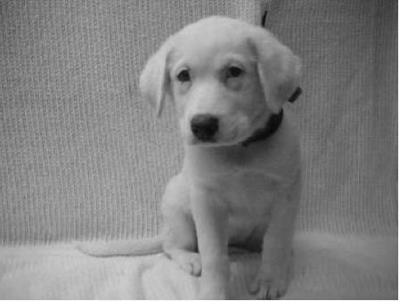

# getting-smaller
Apply the singular value decomposition to image compression and reinforce the Eckart-Young Theorem.

## Low rank approximations to an image using the SVD

Rank-1 approximation 
 
Rank-5 approximation 
 
Rank-20 approximation 
 
Rank-50 approximation 
 
Rank-100 approximation 
 
Original Image 

